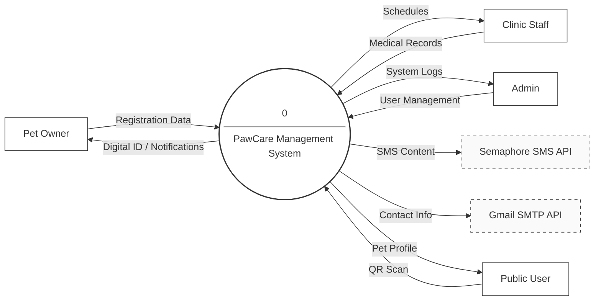
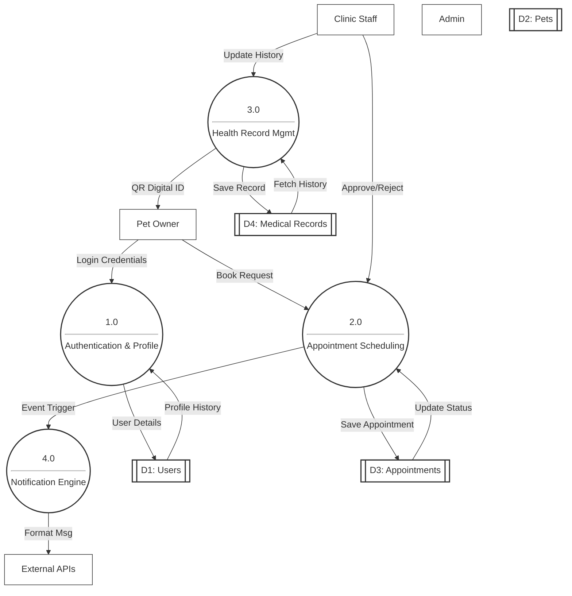

# 📊 Data Flow Diagram (Gane-Sarson Notation)

This document illustrates how data moves through the PawCare Veterinary Management System.

## Level 0: Context Diagram

The Context Diagram shows the system as a single process and its interaction with external entities.

---

## Level 1: Data Flow Diagram

The Level 1 DFD decomposes the system into major functional processes and data stores.

---

### Key Components Definition (Gane-Sarson)

1.  **External Entities**: Represented as squares, these are the sources/destinations of data (Owner, Staff, Admin, and external APIs).
2.  **Processes**: Represented as rounded rectangles, these transform inputs into outputs (Authentication, Scheduling, Medical Tracking).
3.  **Data Stores**: Represented as open-ended rectangles, these hold the system's persistent information (Users, Pets, Appointments, Vaccines).
4.  **Data Flows**: Arrows showing the direction of information movement.
